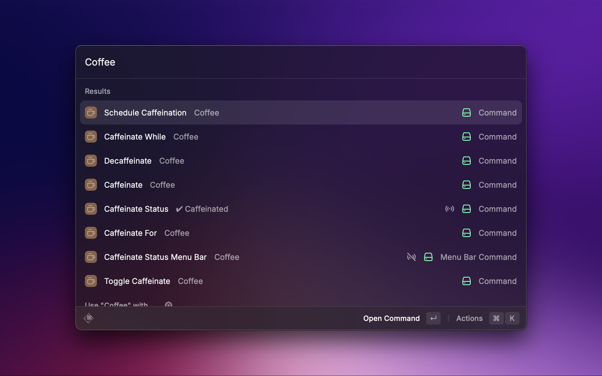
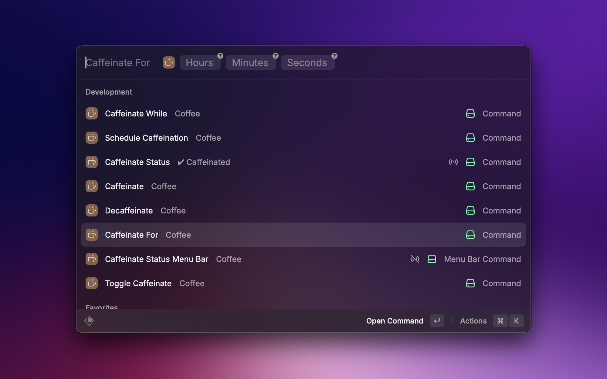
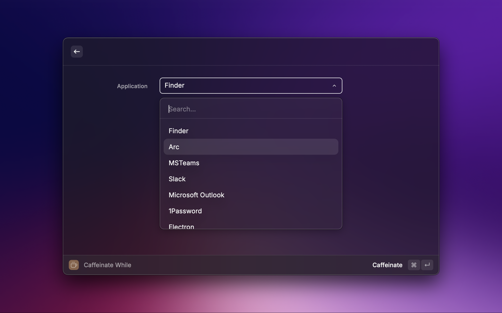
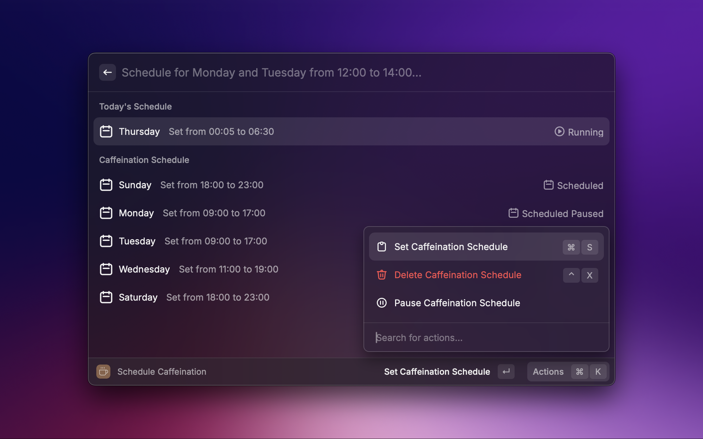

<p align="center">
  
  <h1 align="center">Coffee V1</h1>
</p>

**Coffee V1** is an unofficial macOS compatibility fork of [Coffee](https://github.com/raycast/extensions/tree/2801380b5f250a8666c085b66ab890c620eb15ad/extensions/coffee), targeting Raycast **1.104.29**. It keeps the upstream macOS functionality and fixes through September 17, 2026, while pinning `@raycast/api` to `1.104.25` and `@raycast/utils` to `2.2.2`. Windows support and its Rust bridge have been removed. Compatibility with every older Raycast 1.x release is not implied.

The original extension is by **mooxl and the Coffee contributors**. The upstream MIT license and contributor list are retained. This repository contains only the Coffee extension, imported from upstream commit `2801380b5f250a8666c085b66ab890c620eb15ad`.

## Installation 🛠️

Use a stable local checkout directory that you intend to keep. Requires an existing Node.js installation **22.22.2 or later**, npm, and Raycast 1.104.29 on macOS.

```sh
npm ci
npm run build
npm run dev
```

`build` exports to this checkout's `dist/` directory without installing into Raycast. `dev` registers the local extension in Raycast; search for commands under **Coffee V1**. You can stop the development watcher with Ctrl+C after the extension has loaded.

The distinct `coffee-v1` identifier keeps this fork separate from Store Coffee. Preferences, schedules, and hotkeys must be configured for the new extension. Disable the original Coffee commands and background schedules before using the fork: upstream Coffee controls system `caffeinate` processes with `killall`, so the two extensions should not manage sleep prevention at the same time.

Do not install this fork through the Store's **Coffee** entry: that entry installs the upstream API 2.x version. To remove the fork, remove **Coffee V1** through Raycast's extension settings.

## Development and verification

```sh
npm test
npm run build
npm run lint
```

The inherited tests cover duration input, process arguments, and HUD ordering using mocked Raycast APIs and child processes. Successful tests and compilation do not replace an in-app check on Raycast 1.x. Before relying on it, check timed caffeination and expiry, manual stop, the menu bar, application selection, and a short schedule in Raycast. AI tools retain upstream behavior and still depend on the host's AI access.

Keep the Raycast API and utils versions pinned when updating dependencies. The Store publish script is intentionally omitted from this personal fork.

## Usage 🚀

Once installed, simply trigger the Raycast command palette and search for the desired caffeination command.

<p align="center">
  
</p>

## Features ✨

### 1. **Caffeinate/Decaffeinate**

Keep your computer awake indefinitely or cancel the caffeination.

### 2. **Toggle Caffeination**

Toggle between keeping your computer caffeinated and in a decaffeinated state.

### 3. **Caffeinate For**

Caffeinate your computer for a specified amount of time.

<p align="center">
  
</p>

### 4. **Caffeinate While**

Keep your computer awake as long as a specific app is running.

<p align="center">
  
</p>

### 5. **Schedule Caffeination**

Set up a custom caffeination schedule using natural language.  
Examples:

> ⏳ Schedule for everyday except Tuesday from 13:00 to 20:00  
> ⏳ Schedule for Monday and Thursday from 09:00 to 14:00  
> ⏳ Schedule from 10:00 to 16:30 (adds schedule for all days)  
> ⏳ Saturday and Sunday from 20:00 to 23:30

Supported Actions:

- Add a Schedule
- Pause/Resume Schedule
- Delete a Schedule

> 📋 **Note:** If you pause a schedule, you must manually resume it for it to work the next week or any future instances.

<p align="center">
  
</p>

### 6. **Caffeination Status**

Get the current state of caffeination.

### 7. **Caffeinate Status Menu Bar**

Get the status of current caffeination in your menu bar.

### 8. **Auto-Caffeinate on Launch**

Optionally have Coffee start caffeinating your computer (indefinitely) automatically whenever Raycast launches. Enable the **Start caffeination when Raycast starts** toggle under the **Launch** section in the extension's preferences.

> **Requirements:** Either the _Caffeinate Status_ command (1 m background interval) or the _Caffeinate Status Menu Bar_ command (1 m background interval) must be enabled in Raycast — the auto-start feature piggybacks on these background ticks.

**How session detection works:** Coffee tracks the Raycast process PID. A new PID means Raycast actually relaunched, so the computer is caffeinated automatically. Putting the computer to sleep and waking it does **not** trigger a re-caffeination, because the PID stays the same — your manual decaffeination is honoured until you truly restart Raycast.
